# BaseStack - Use Case & Flow Diagrams

## 1. Use Case Diagram

```mermaid
graph TB
    subgraph "BaseStack System"
        UC1[🔐 Connect Wallet / Login]
        UC2[📋 Create Plan]
        UC3[📊 View Dashboard Metrics]
        UC4[📝 List Plans]
        UC5[🛒 View Checkout Page]
        UC6[💳 Subscribe to Plan]
        UC7[📜 View My Subscriptions]
        UC8[❌ Cancel Subscription]
        UC9[⚡ Auto Charge Subscription]
    end

    Merchant((👤 Merchant))
    Subscriber((👤 Subscriber))
    Keeper((🤖 Keeper Bot))

    Merchant --> UC1
    Merchant --> UC2
    Merchant --> UC3
    Merchant --> UC4

    Subscriber --> UC5
    Subscriber --> UC6
    Subscriber --> UC7
    Subscriber --> UC8

    Keeper --> UC9

    UC2 -.->|requires| UC1
    UC3 -.->|requires| UC1
    UC4 -.->|requires| UC1
    UC6 -.->|requires| UC5
```

## 2. Merchant Login Flow

## 3. Create Plan Flow

## 4. Subscriber Checkout Flow

## 5. Keeper Bot Billing Flow

## 6. Cancel Subscription Flow

## 7. Complete System Flow

```mermaid
flowchart TD
    subgraph Merchant["👤 Merchant Flow"]
        M1[Connect Wallet] --> M2[Create Plans]
        M2 --> M3[View Dashboard]
        M3 --> M4[Monitor Subscribers]
    end

    subgraph Subscriber["👤 Subscriber Flow"]
        S1[Browse Plans] --> S2[Select Plan & Token]
        S2 --> S3[Approve Token]
        S3 --> S4[Subscribe On-chain]
        S4 --> S5[Subscription Active]
        S5 --> S6{Continue?}
        S6 -->|Yes| S7[Auto-renewed by Keeper]
        S6 -->|No| S8[Cancel Subscription]
        S7 --> S5
    end

    subgraph Keeper["🤖 Keeper Bot"]
        K1[Cron Job Every Hour] --> K2[Query Due Subscriptions]
        K2 --> K3[Charge On-chain]
        K3 --> K4{Success?}
        K4 -->|Yes| K5[Update nextPayment]
        K4 -->|No| K6[Mark as past_due]
        K5 --> K7[Log Result]
        K6 --> K7
    end

    M2 -.->|Creates| Plans[(Plans DB)]
    S1 -.->|Reads| Plans
    S4 -.->|Creates| Subs[(Subscriptions DB)]
    K2 -.->|Reads| Subs
    K5 -.->|Updates| Subs
    K6 -.->|Updates| Subs
```

## 8. State Diagram - Subscription Status

---

